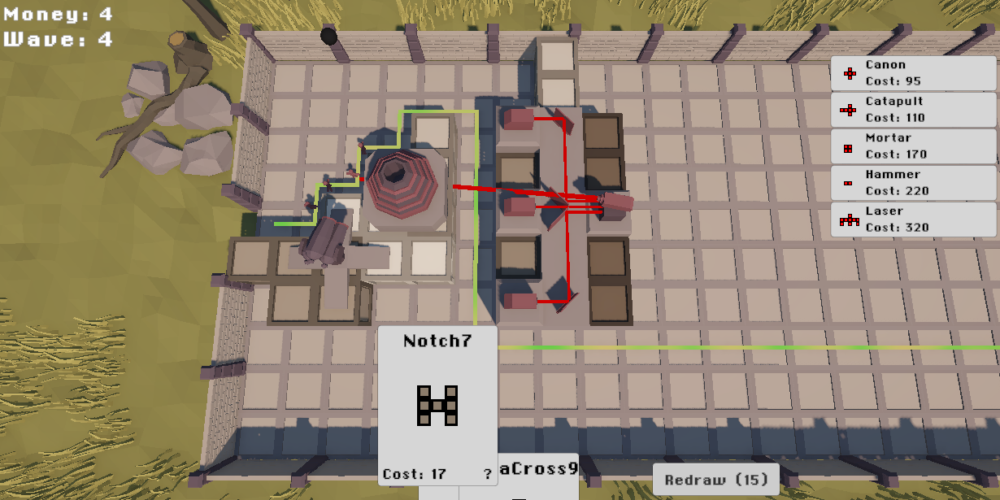

# Tetra Defense

A Tower Defense Game made with Unity where platforms and towers are tetris shaped pieces.

## Architecture

The project is organized into several key modules in the `Assets/Scripts` folder:

### Core Systems

- **Tower**: Tower implementation with base class (`BaseTower`) and specific tower types (Cannon, Catapult, Hammer, Laser). Includes projectile systems (`Bullet`, `PhysicsBullet`, `InstantBullet`) and range visualization.

- **Enemy**: Enemy system with base class (`BaseEnemy`), enemy movement (`EnemyMotor`), animations (`EnemyWaddle`), and `EnemyManager` for orchestrating enemy behavior.

- **World**: Organized using MVC pattern with three subdirectories:
  - `Data`: World state and data models
  - `Service`: Game logic and services
  - `View`: Visual representation and rendering

- **Economy**: Resource management system (`Economy.cs`) handling player currency and resources.

### Systems & Utilities

- **Events**: Event bus architecture (`EventBus`, `IEvent`) for decoupled communication between systems. Includes game events like `TowerPlaceEvent`, `PlatformPlaceEvent`, `EnemyWaveStartEvent`, `GameOverEvent`, etc.

- **UI**: User interface layer with managers for tower selection, piece selection, and various UI panels (Economy, Lives, Wave, Tower Info, Game Over, Main Menu).

- **ScriptableObjects**: Data configuration using ScriptableObjects for `TowerSO`, `PlatformSO`, and `EnemySO`.

